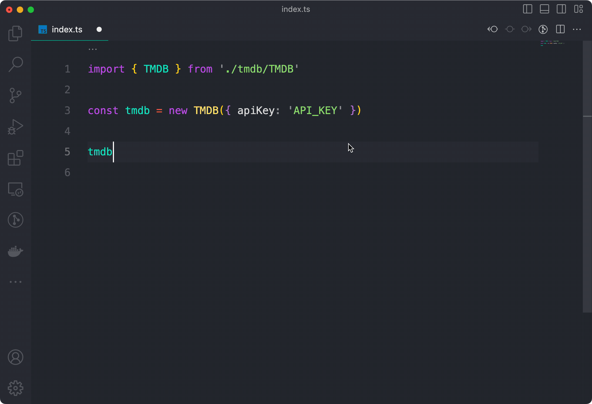

# 🍿 TMDB Typescript client
This package is a typescript wrapper client for [The Movie Database API](https://developers.themoviedb.org/3/getting-started/introduction). It provides an easy way to use and acceess TMDB
available apis at version 3.



## Installation
```ts
// Using npm
npm i @lewkz/tmdb

// Using yarn
yarn add @lewkz/tmdb
```

## Basic usage
This client is organized in the same namespace structure present on [TMDB documentation](https://developers.themoviedb.org/3/getting-started/introduction). You'll need create a register and an [API key](https://www.themoviedb.org/settings/api) to interact with TMDB API. After that, just create a new instance from
TMDB wrapper client:
```ts
import { TMDB } from '@lewkz/tmdb'

const tmdb = new TMDB({ apiKey: 'CREATED_ON_TMDB' })

const fightClub = await tmdb.movies.details(550)

console.log(fightClub)

{
  "adult": false,
  "backdrop_path": "/fCayJrkfRaCRCTh8GqN30f8oyQF.jpg",
  "belongs_to_collection": null,
  "budget": 63000000,
  "genres": [...],
  "homepage": "",
  "id": 550,
  "imdb_id": "tt0137523",
  "original_language": "en",
  "original_title": "Fight Club",
  "overview": "A ticking-time-bomb insomniac and a slippery soap salesman channel primal male aggression into a shocking new form of therapy. Their concept catches on, with underground \"fight clubs\" forming in every town, until an eccentric gets in the way and ignites an out-of-control spiral toward oblivion.",
  "popularity": 0.5,
  "poster_path": null,
  "production_companies": [...],
  "production_countries": [...],
  "release_date": "1999-10-12",
  "revenue": 100853753,
  "runtime": 139,
  "spoken_languages": [...],
  "status": "Released",
  "tagline": "How much can you know about yourself if you've never been in a fight?",
  "title": "Fight Club",
  "video": false,
  "vote_average": 7.8,
  "vote_count": 3439
}
```

## Namespaced APIs
This client wraps all available apis as namespaces inside of it. All you need is
invoke them under a single client and your IDE must autocomplete everything:


```ts
import { TMDB } from '@lewkz/tmdb'

export const tmdb = new TMDB({ apiKey: 'YOUR_API_KEY' })

console.log(
  // https://developers.themoviedb.org/3/certifications/get-movie-certifications
  await tmdb.certifications.movie(),

  // https://developers.themoviedb.org/3/certifications/get-tv-certifications
  await tmdb.certifications.tv()
)
```
